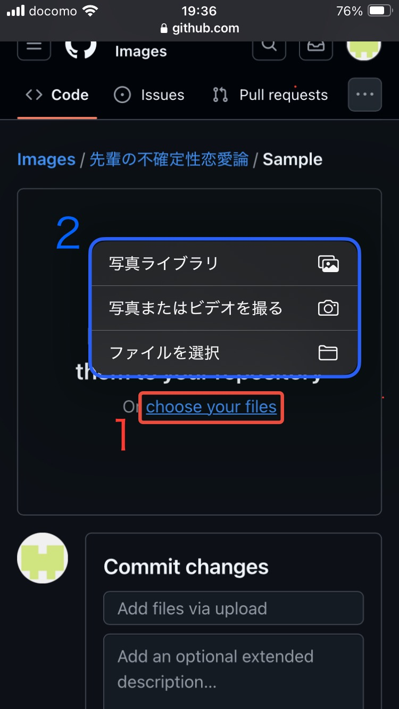

# Images  

画像保存&共有用リポジトリ

---
## 目次  
[アップロード方法](https://github.com/Nelu1223/Images/blob/main/README.md#%E3%82%A2%E3%83%83%E3%83%97%E3%83%AD%E3%83%BC%E3%83%89%E6%96%B9%E6%B3%95)

---

## アップロード方法  
### 1. サインイン (アカウントがない場合は作成)

### 2. アップロード先を選択
画像をアップロードしたいファイルを開き、下の画像のマークに従いアップロード作業を開始。

### 3. アップロード写真を選択  
(2)の操作完了後、下の画像の画面が表示されるため、マークに従いスマホの写真及びファイル一覧を表示させ、任意の画像を選択。  

### 4. アップロード完了  
画像を選択後、下にスクロールし、下の画像でマークされたボタンをタップし操作を完了させる。

